# Práctica SonoraDB — Respuestas y evidencias

> **Nota:** Las cuestiones teóricas están respondidas directamente. En los ejercicios que requieren ejecutar una consulta o un script en SQL Server, se deja un espacio para pegar la captura de pantalla del resultado en SSMS.

## 1. Exploración de la base de datos

### Ejercicio 1

Comprueba que trabajas con SQL Server 2025 y que `SonoraDB` tiene el nivel de compatibilidad correcto. En una sola consulta, muestra la versión principal del motor (`SERVERPROPERTY`) y el nivel de compatibilidad de `SonoraDB` (`sys.databases`).

**Evidencia — captura del resultado en SSMS:**

### Ejercicio 2

Lista los nombres de las tablas de usuario de `SonoraDB` usando la vista de catálogo `sys.tables`, ordenados alfabéticamente.

**Evidencia — captura del resultado en SSMS:**

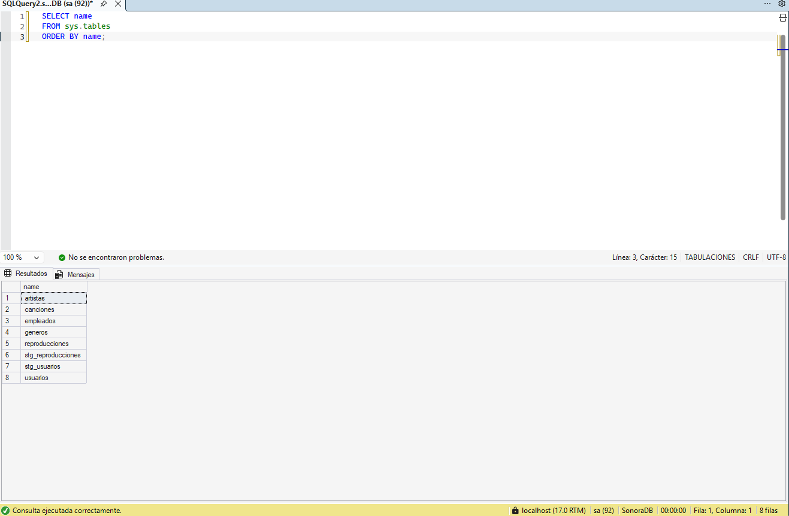

### Ejercicio 3

Usando `INFORMATION_SCHEMA.COLUMNS`, muestra las columnas de la tabla `reproducciones` con su tipo de dato, su longitud máxima y si admiten nulos, en el orden en que están definidas.

**Evidencia — captura del resultado en SSMS:**

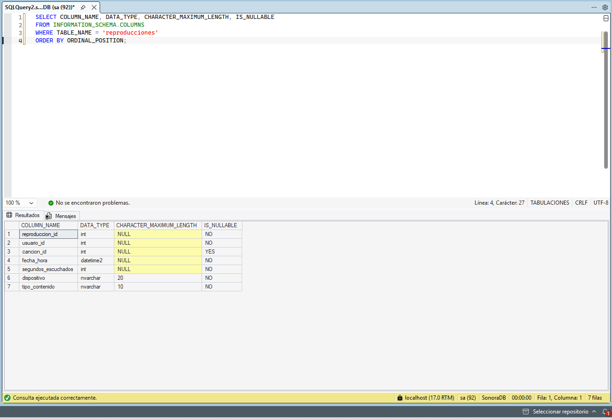

## 2. Consultas básicas: SELECT, WHERE y ORDER BY

### Ejercicio 4

Muestra el nombre de usuario, el plan y la fecha de alta de los usuarios de España (`ES`), del más antiguo al más reciente.

**Evidencia — captura del resultado en SSMS:**

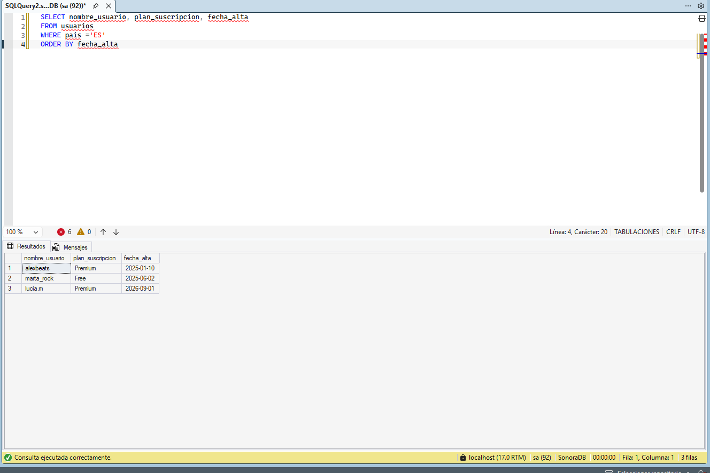

### Ejercicio 5

El equipo editorial busca canciones lanzadas en 2026 que duren entre 170 y 200 segundos (ambos incluidos) para una playlist de radio. Muestra título, duración y fecha de lanzamiento, ordenadas por fecha. Filtra el año con un rango de fechas, sin aplicar funciones sobre la columna.

**Evidencia — captura del resultado en SSMS:**

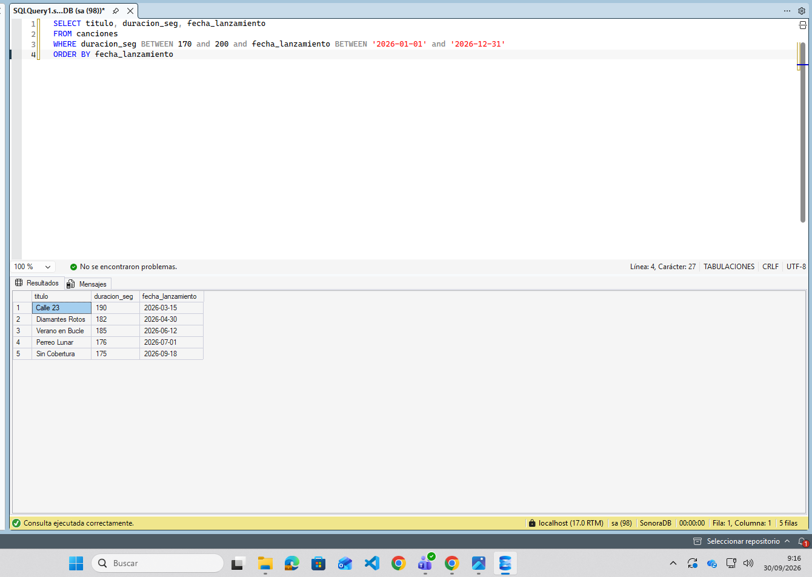

---

### Ejercicio 6

Obtén los usuarios cuyo nombre de usuario contiene un guion bajo (`_`), ordenados alfabéticamente. Antes de escribir la solución correcta, prueba `LIKE '%_%'` y explica por qué devuelve los 8 usuarios.

**Respuesta teórica:**

La expresión `LIKE '%_%'` devuelve los 8 usuarios porque `_` es un comodín de `LIKE` que representa exactamente un carácter cualquiera. Por tanto, el patrón coincide con cualquier nombre de usuario que tenga al menos un carácter, no específicamente con un guion bajo.

Para buscar un guion bajo literal hay que escaparlo. En SQL Server se puede usar, por ejemplo, `LIKE '%[_]%'`, donde `[ _ ]` (sin el espacio) representa el carácter `_` de forma literal.

**Evidencia — captura del resultado en SSMS:**

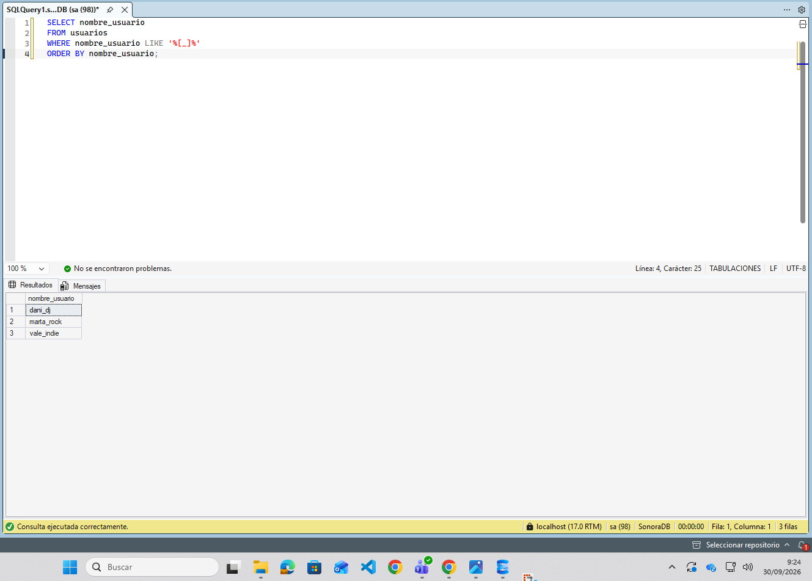

---

### Ejercicio 7

¿Desde qué dispositivos se han hecho reproducciones? Muestra cada dispositivo una sola vez, ordenado alfabéticamente.

**Evidencia — captura del resultado en SSMS:**

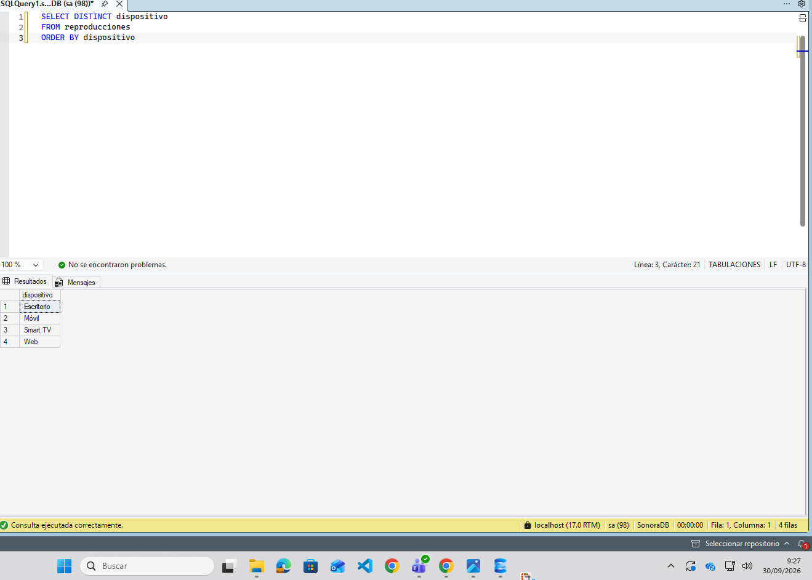

---

### Ejercicio 8

Lista las reproducciones que corresponden a anuncios filtrando por la columna `cancion_id`. Muestra el id de reproducción, el usuario y la fecha y hora. Comprueba también qué devuelve la condición `cancion_id = NULL` y explica el resultado.

**Respuesta teórica:**

La condición `cancion_id = NULL` no encuentra las filas con `NULL` porque `NULL` representa ausencia de valor y no puede compararse mediante `=`. La comparación produce `UNKNOWN`, que no pasa el filtro `WHERE`.

Para comprobar si una columna es nula se utiliza `IS NULL`. Por eso, para localizar los anuncios de esta práctica hay que usar `cancion_id IS NULL`.

**Evidencia — captura del resultado en SSMS:**

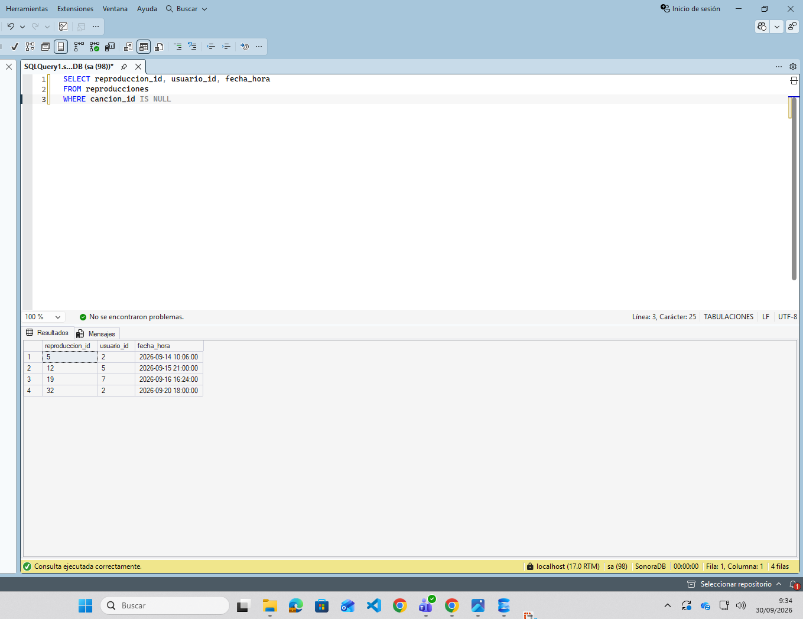

---

### Ejercicio 9

Obtén las 2 reproducciones con más segundos escuchados, pero incluyendo cualquier otra que empate con la última. Muestra id de reproducción, usuario, canción y segundos escuchados.

**Evidencia — captura del resultado en SSMS:**

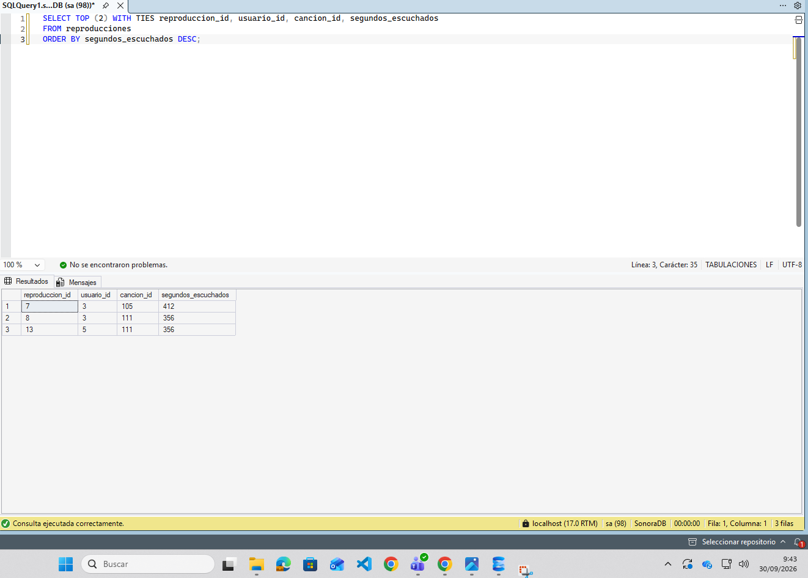

---

### Ejercicio 10

La app muestra el catálogo en páginas de 5 canciones ordenadas por título. Obtén los títulos de la **página 2** con `OFFSET ... FETCH`.

**Evidencia — captura del resultado en SSMS:**

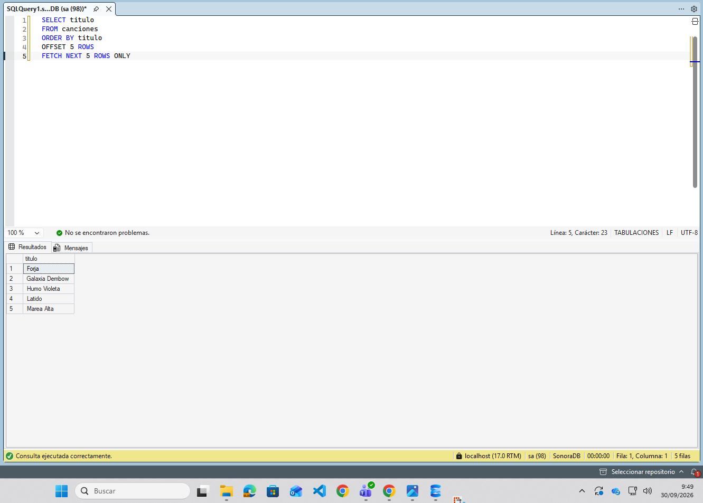

---

## 3. Expresiones y funciones

### Ejercicio 11

Clasifica las canciones de Nébula (artista 5) por duración: `Corta` si dura menos de 180 segundos, `Media` si dura entre 180 y 240 (ambos incluidos) y `Larga` si dura más de 240. Ordena por título.

**Evidencia — captura del resultado en SSMS:**

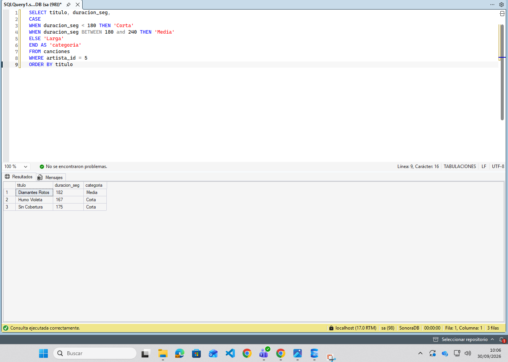

---

### Ejercicio 12

Para la ficha de artista de la app, genera una etiqueta con el formato `Nombre (PAÍS)` y la longitud del nombre en caracteres. Resuélvelo con `CONCAT` y después con el operador `||`, novedad de SQL Server 2025. Ordena por nombre.

**Evidencia — captura del resultado en SSMS:**

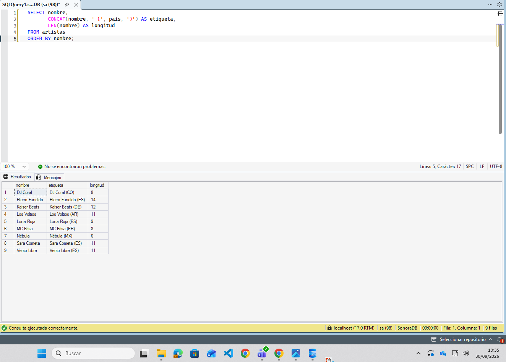

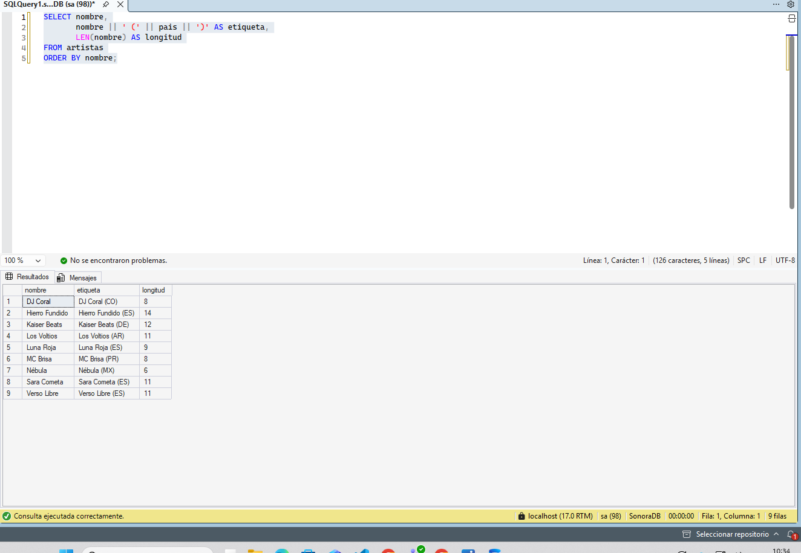

---

### Ejercicio 13

Calcula la antigüedad en días de cada usuario a fecha de 24/09/2026, ordenados de más a menos antiguo.

**Evidencia — captura del resultado en SSMS:**

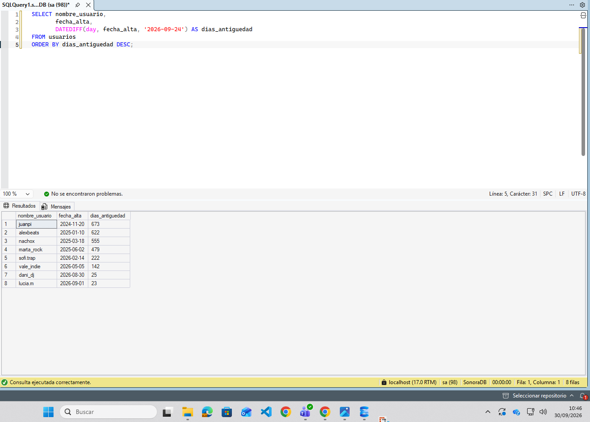

---

### Ejercicio 14

Para las reproducciones del usuario 3, separa `fecha_hora` en dos columnas: la fecha (`date`) y la hora sin fracciones de segundo (`time(0)`). Muestra también los segundos escuchados. Ordena por fecha y hora.

**Evidencia — captura del resultado en SSMS:**

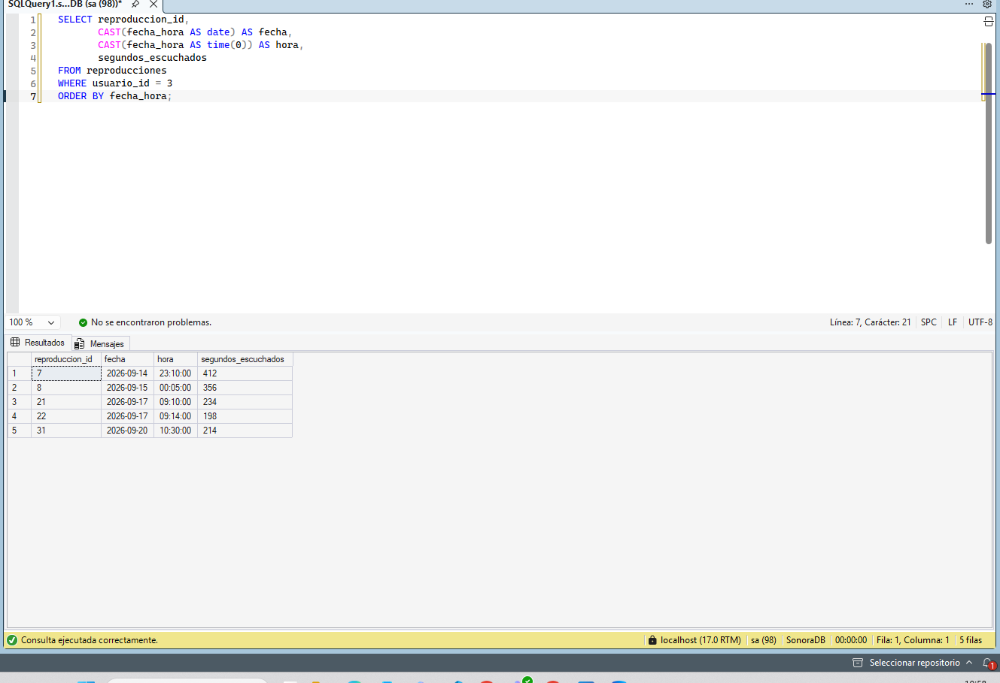

---

## 4. Funciones de agregación, GROUP BY y HAVING

### Ejercicio 15

Obtén un resumen del catálogo: número de canciones, duración mínima, duración máxima y duración media. Calcula la media dos veces, sobre la columna tal cual y forzando decimales, y explica la diferencia.

**Respuesta teórica:**

La media calculada directamente sobre `duracion_seg`, que es de tipo entero, se devuelve como un valor entero (`232`) porque el resultado conserva un tipo numérico entero y se trunca la parte decimal.

Al forzar una operación decimal antes de aplicar `AVG`, el resultado conserva decimales y se obtiene `232.200000`. La diferencia está en el tipo de datos utilizado para realizar la agregación.

**Evidencia — captura del resultado en SSMS:**

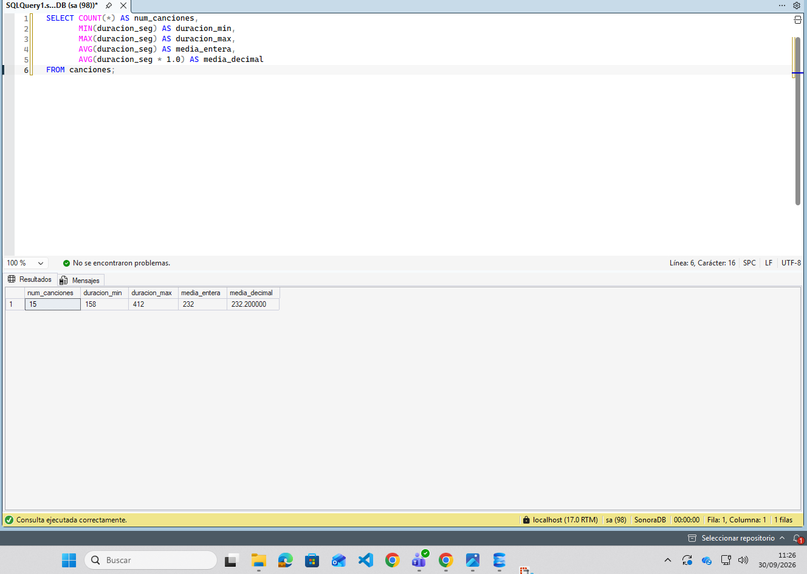

---

### Ejercicio 16

Sobre la tabla `reproducciones`, calcula en una sola consulta: `COUNT(*)`, `COUNT(cancion_id)`, el número de canciones distintas reproducidas y el número de usuarios distintos. Explica por qué las dos primeras cifras no coinciden.

**Respuesta teórica:**

`COUNT(*)` cuenta todas las filas de `reproducciones`, incluidas las reproducciones de anuncios, por lo que devuelve 33.

`COUNT(cancion_id)` solo cuenta las filas en las que `cancion_id` no es `NULL`, por lo que devuelve 29. Las 4 filas de anuncios tienen `cancion_id = NULL` y no se incluyen en este segundo conteo.

**Evidencia — captura del resultado en SSMS:**

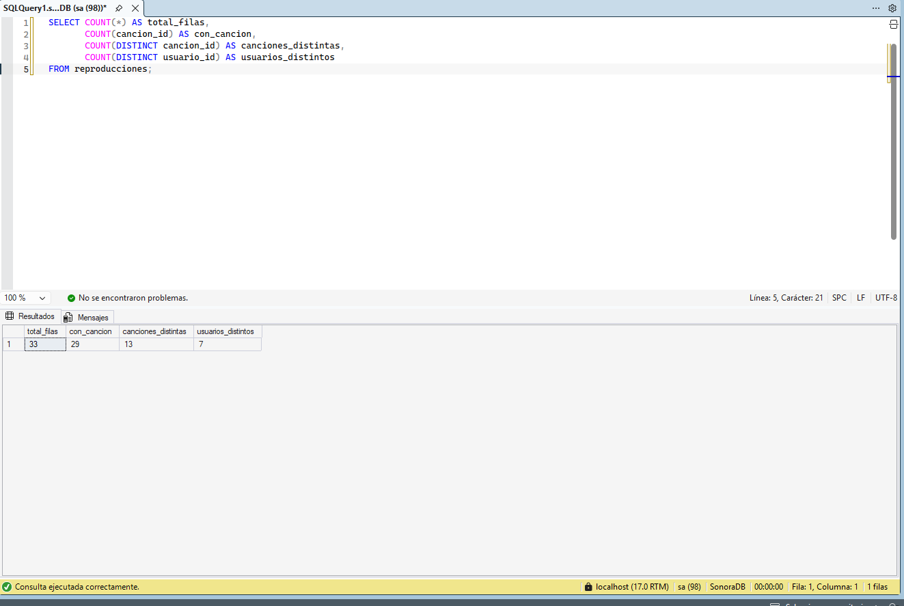

---

### Ejercicio 17

Para cada dispositivo, obtén el número de reproducciones (de cualquier tipo), el total de segundos y el total de minutos con un decimal. Ordena por número de reproducciones de mayor a menor.

**Evidencia — captura del resultado en SSMS:**

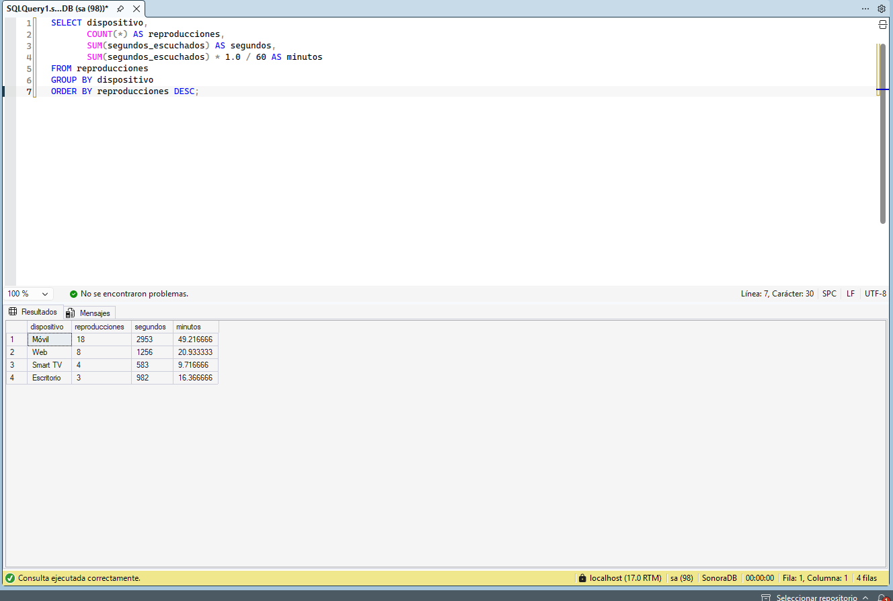

---

### Ejercicio 18

Usando la clasificación del Ejercicio 11 (`Corta`, `Media`, `Larga`) sobre **todo** el catálogo, obtén cuántas canciones hay en cada categoría y su duración media. Ordena por número de canciones descendente y por categoría.

**Evidencia — captura del resultado en SSMS:**

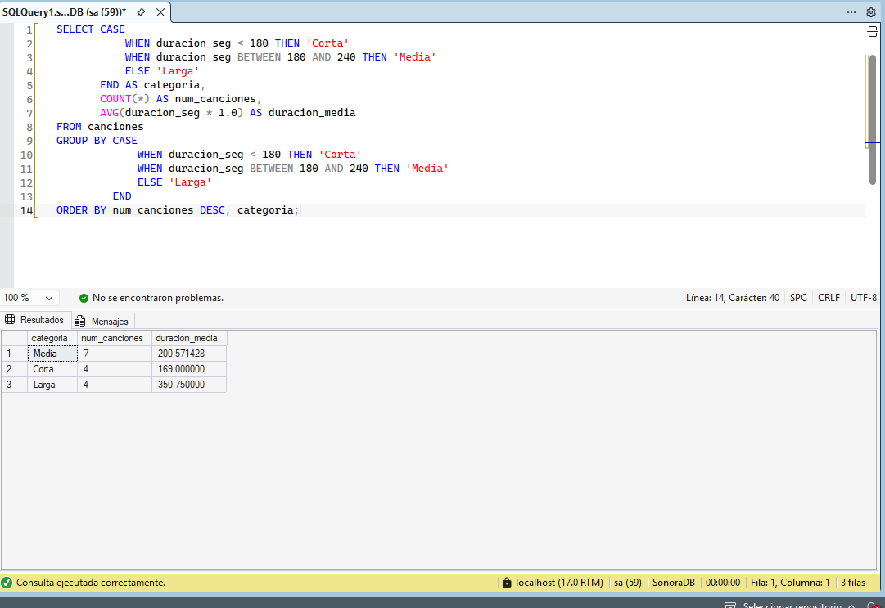

---

### Ejercicio 19

Marketing busca "superoyentes": usuarios con más de 3 reproducciones de tipo `Canción` y más de 800 segundos escuchados en total. Muestra el nombre de usuario, el número de reproducciones y los segundos. Ordena por segundos de mayor a menor.

**Evidencia — captura del resultado en SSMS:**

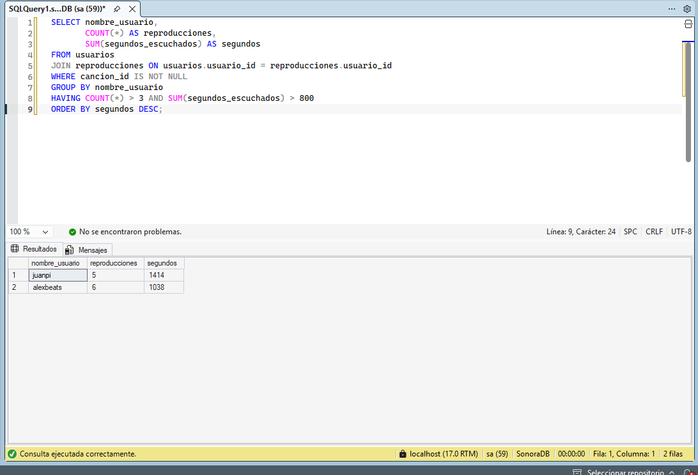

---

### Ejercicio 20

Obtén el número de reproducciones por plan de suscripción y tipo de contenido. Ordena por plan y tipo.

**Evidencia — captura del resultado en SSMS:**

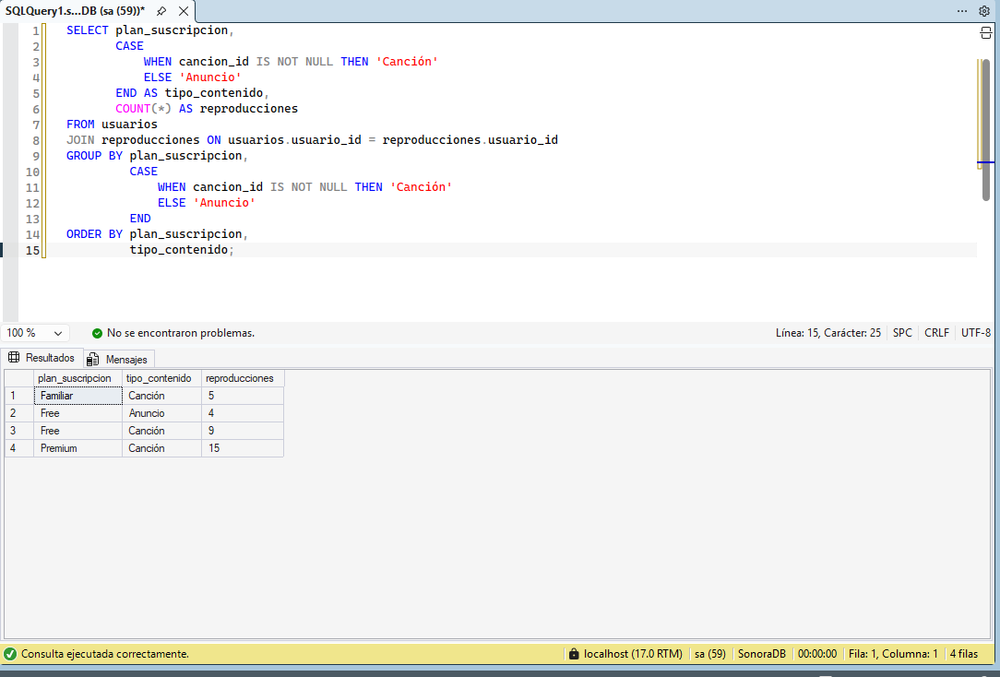

---

## 5. JOIN y UNION

### Ejercicio 21

Lista las canciones de artistas españoles con el nombre del artista y el nombre del género de la canción. Ordena por artista y título.

**Evidencia — captura del resultado en SSMS:**

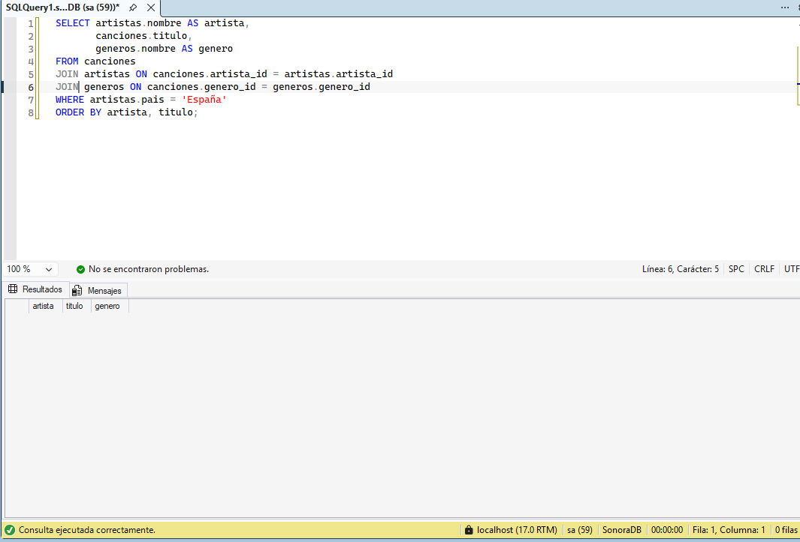

---

### Ejercicio 22

Muestra la actividad del 16/09/2026 con `INNER JOIN`: hora, usuario, título y artista, ordenada por fecha y hora. Filtra el día con un rango de fechas.

**Evidencia — captura del resultado en SSMS:**

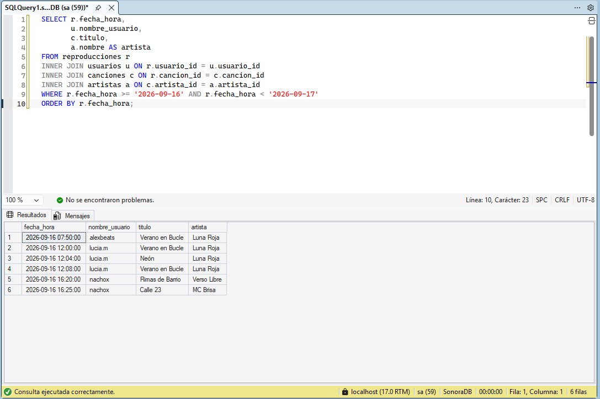

---

### Ejercicio 23

Ese día hubo 7 reproducciones, pero el Ejercicio 22 solo devuelve 6. Explica qué fila falta y por qué. Reescribe la consulta para que aparezcan todas, mostrando `(Anuncio)` en el título y `-` en el artista cuando no haya canción.

**Respuesta teórica:**

La fila que falta en el ejercicio anterior es la reproducción de las `16:24`, correspondiente a un anuncio. Su `cancion_id` es `NULL`, por lo que un `INNER JOIN` con `canciones` no encuentra una fila relacionada y elimina esa reproducción del resultado.

Para conservar también las reproducciones sin canción hay que partir de `reproducciones` y utilizar `LEFT JOIN` hacia `canciones`. Después se puede usar `COALESCE` para mostrar `(Anuncio)` cuando no exista título y `-` cuando no exista artista.

**Evidencia — captura del resultado en SSMS:**

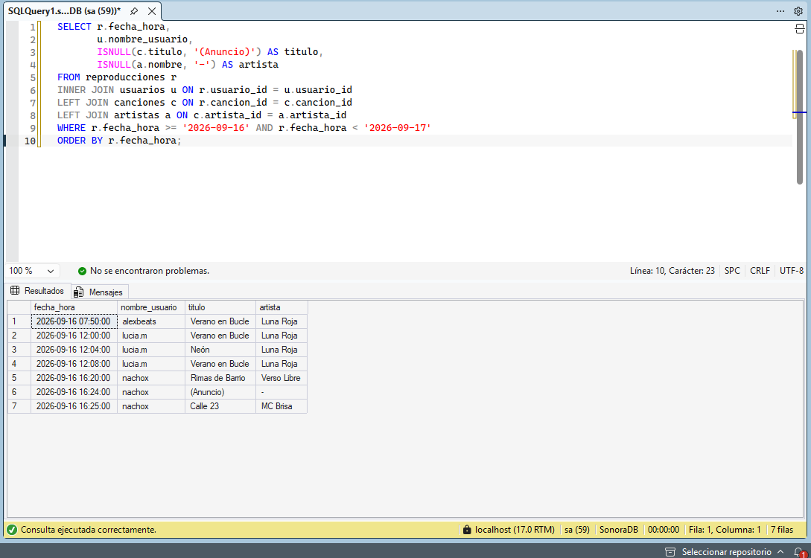

---

### Ejercicio 24

Con `LEFT JOIN` e `IS NULL`, obtén los usuarios que no tienen ninguna reproducción. Muestra el nombre de usuario, el plan y la fecha de alta.

**Evidencia — captura del resultado en SSMS:**

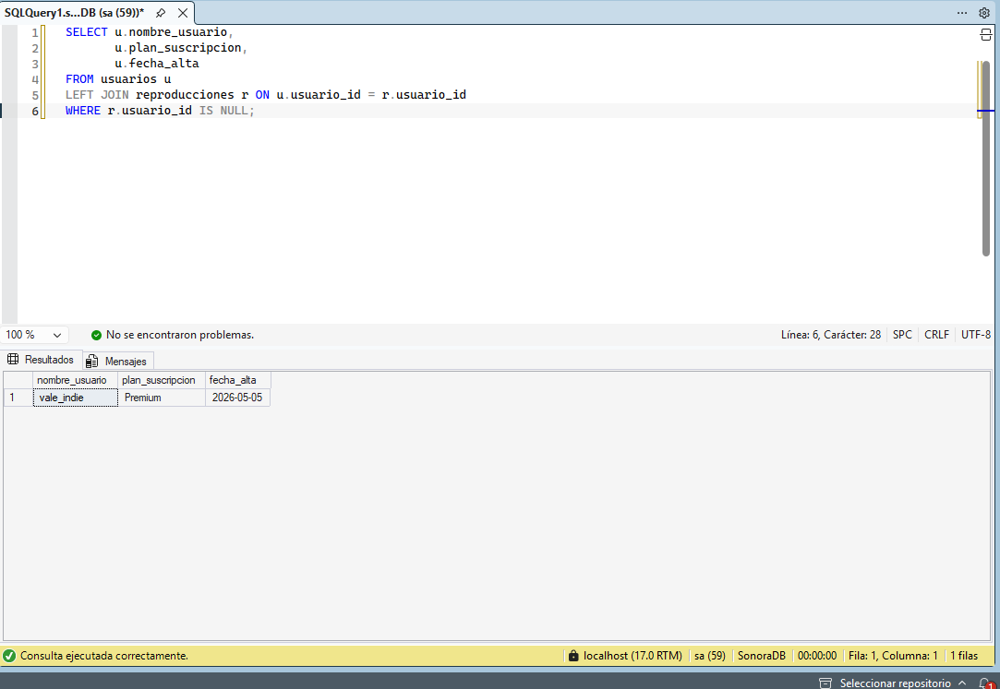

---

### Ejercicio 25

Obtén el número de reproducciones de cada artista, **incluidos los que no tienen ninguna**. Ordena por reproducciones descendente y por nombre. Después cambia el conteo a `COUNT(*)` y explica por qué Sara Cometa pasa a tener 1.

**Respuesta teórica:**

Con un `LEFT JOIN`, `COUNT(r.cancion_id)` cuenta únicamente las reproducciones que tienen una canción asociada. Para Sara Cometa no existe ninguna reproducción relacionada, por lo que el valor es 0.

Si se cambia a `COUNT(*)`, la fila de Sara Cometa que genera el `LEFT JOIN` sigue existiendo aunque las columnas de `reproducciones` sean `NULL`. Por eso `COUNT(*)` cuenta esa fila y Sara pasa a aparecer con 1. Esto demuestra la diferencia entre contar filas y contar valores no nulos de una columna.

**Evidencia — captura del resultado en SSMS:**

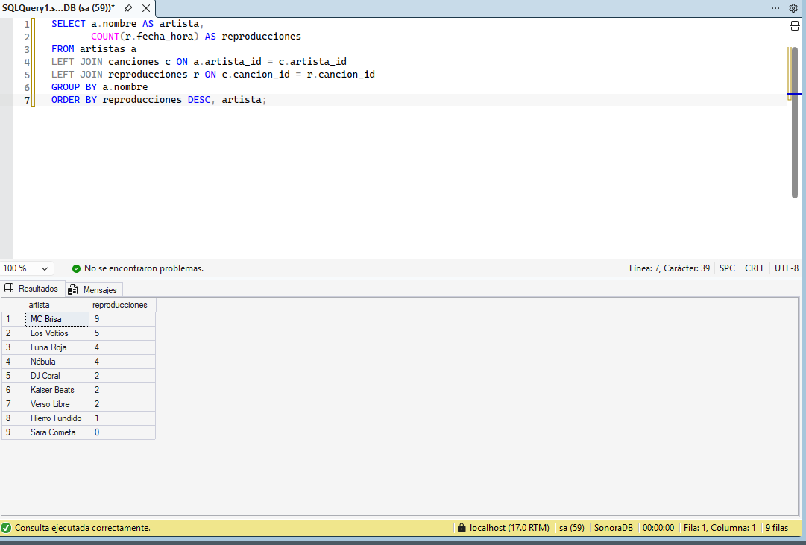

---

### Ejercicio 26

Con un self join sobre `empleados`, muestra cada empleado con su puesto y el nombre de su jefe directo. Para quien no tiene jefe, muestra `(sin jefe)`. Ordena por id de empleado.

**Evidencia — captura del resultado en SSMS:**

---

### Ejercicio 27

Obtén los géneros (de la canción) con más de 3 reproducciones válidas, con el número de reproducciones y los minutos escuchados con un decimal. Ordena por reproducciones descendente.

**Evidencia — captura del resultado en SSMS:**

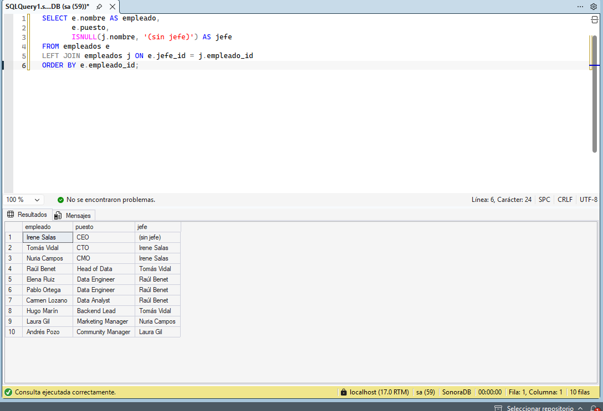

---

### Ejercicio 28

Sonora quiere saber en qué países tiene presencia, ya sea por artistas o por usuarios. Obtén la lista de países sin repetir, ordenada. Después cambia a `UNION ALL`, cuenta las filas y explica la diferencia.

**Respuesta teórica:**

`UNION` elimina los duplicados entre los resultados combinados, por lo que cada país aparece una sola vez. En esta práctica el resultado contiene 6 países: `AR`, `CO`, `DE`, `ES`, `MX` y `PR`.

`UNION ALL` no elimina duplicados: conserva todas las filas procedentes de ambas consultas. Por eso devuelve 17 filas en esta práctica, aunque varios países aparezcan repetidos.

**Evidencia — captura del resultado en SSMS:**

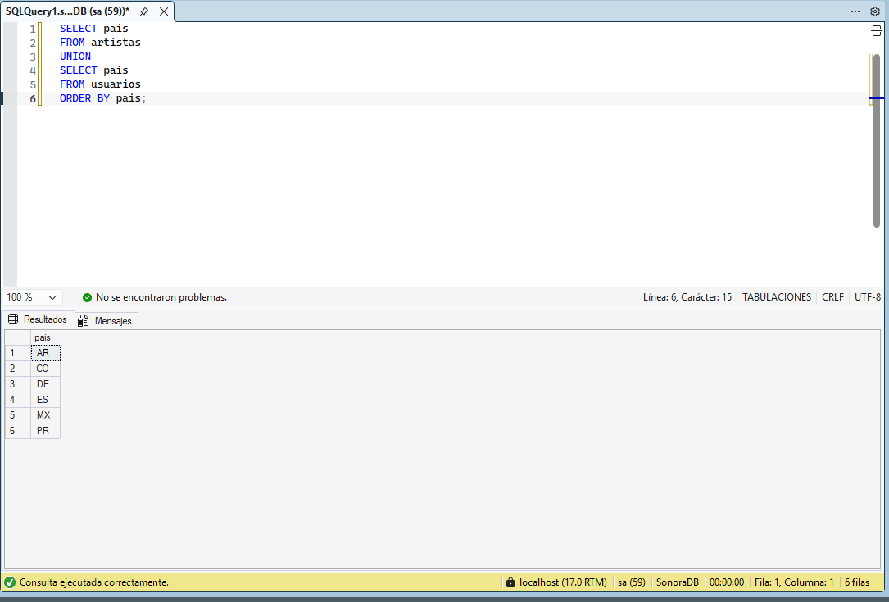

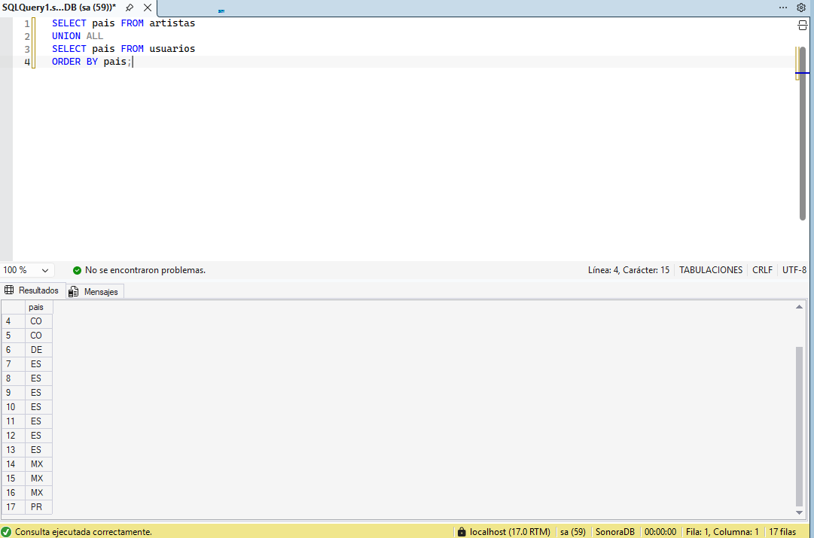

---

## 6. DDL: crear y modificar tablas

### Ejercicio 29

Crea la tabla `dbo.playlists` con estas columnas y restricciones. Da nombre explícito a cada restricción.

| Columna        | Tipo          | Reglas                                             |
| -------------- | ------------- | -------------------------------------------------- |
| playlist_id    | int           | Clave primaria, autonumérica empezando en 1        |
| usuario_id     | int           | Obligatoria. Clave foránea a `usuarios`            |
| nombre         | nvarchar(100) | Obligatoria                                        |
| es_publica     | bit           | Obligatoria. Por defecto 0                         |
| fecha_creacion | datetime2(0)  | Obligatoria. Por defecto, la fecha y hora actuales |

Además, un mismo usuario no puede tener dos playlists con el mismo nombre.

**Evidencia — captura del resultado en SSMS:**

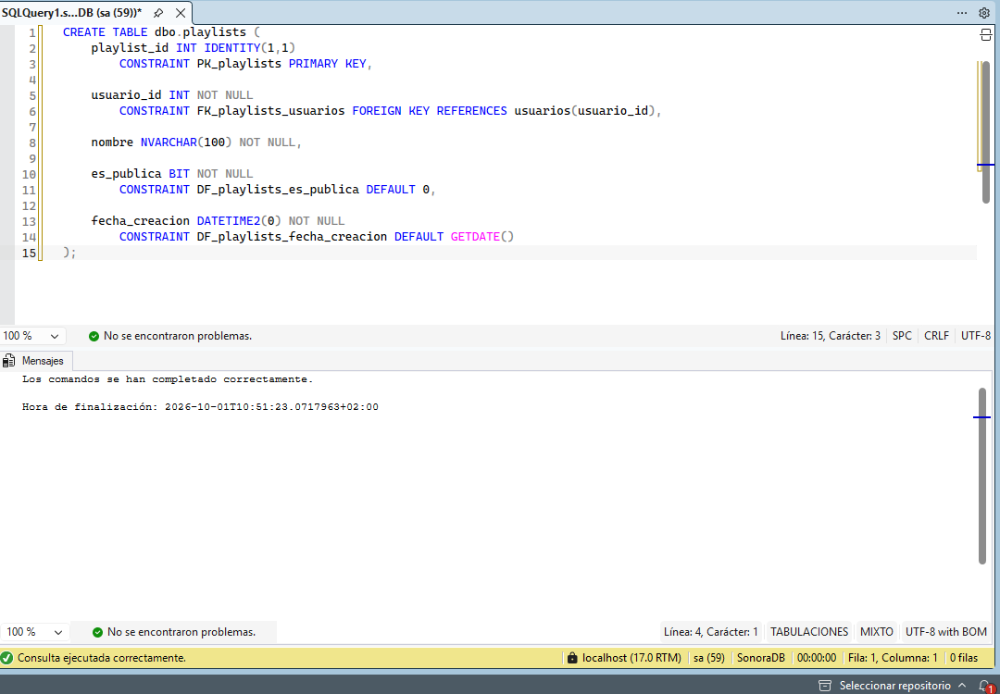

---

### Ejercicio 30

Crea la tabla `dbo.playlist_canciones`, que relaciona cada playlist con sus canciones:

| Columna        | Tipo         | Reglas                                             |
| -------------- | ------------ | -------------------------------------------------- |
| playlist_id    | int          | Obligatoria. Clave foránea a `playlists`           |
| cancion_id     | int          | Obligatoria. Clave foránea a `canciones`           |
| fecha_agregada | datetime2(0) | Obligatoria. Por defecto, la fecha y hora actuales |

La clave primaria es compuesta (`playlist_id`, `cancion_id`): una canción no puede estar dos veces en la misma playlist.

**Evidencia — captura del resultado en SSMS:**

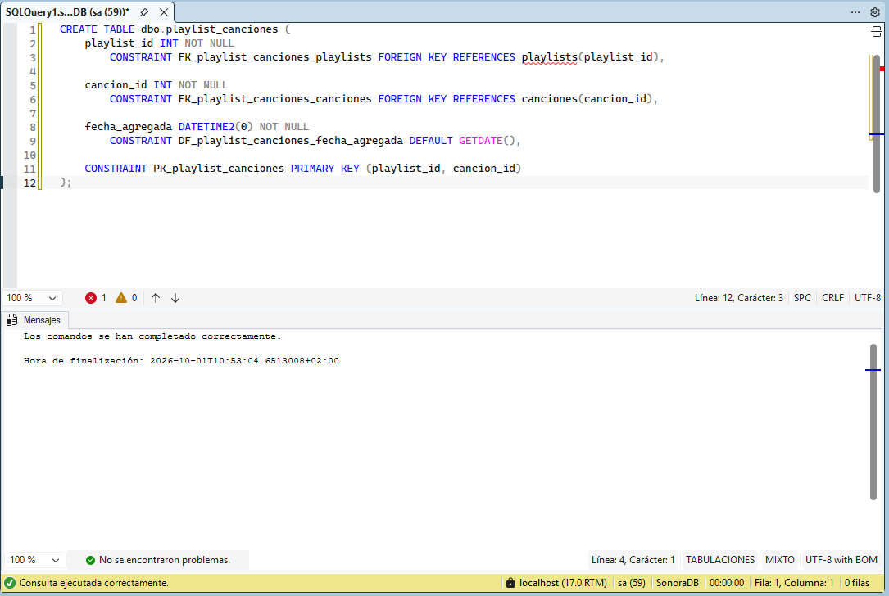

---

### Ejercicio 31

Tras una reunión con Producto, hay dos cambios en `playlists`. Aplícalos con `ALTER TABLE`:

- Añadir la columna opcional `descripcion` de tipo `nvarchar(200)`.
- Añadir una restricción que obligue a que el nombre tenga al menos 3 caracteres.

Comprueba el resultado consultando `INFORMATION_SCHEMA.COLUMNS` para la tabla `playlists`.

**Evidencia — captura del resultado en SSMS:**

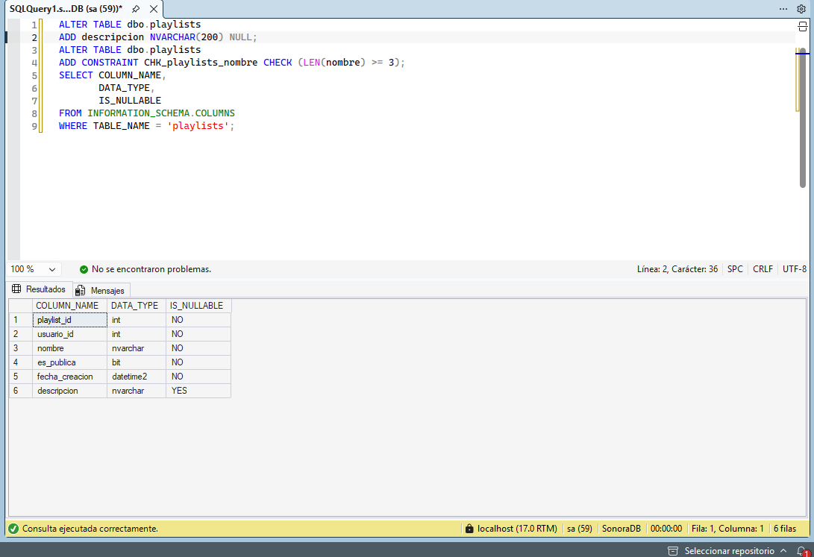

---

## 7. DML: insertar, actualizar y borrar

### Ejercicio 32

Inserta en una sola instrucción estas tres playlists, sin indicar `playlist_id`, `es_publica` ni `fecha_creacion`. Después consulta la tabla.

| usuario        | nombre           |
| -------------- | ---------------- |
| alexbeats (1)  | Perreo Mañanero  |
| marta_rock (2) | Rock para currar |
| juanpi (3)     | Code & Techno    |

**Evidencia — captura del resultado en SSMS:**

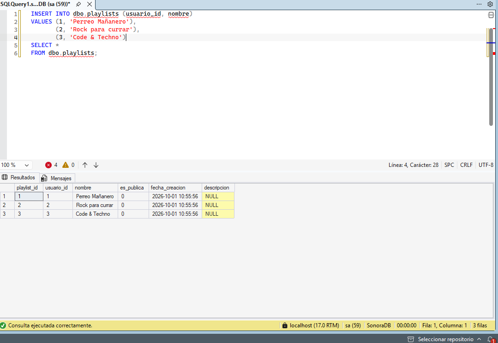

---

### Ejercicio 33

Añade canciones a las playlists:

- A la playlist 1, las canciones 103, 104 y 113, con un `INSERT` de varias filas.
- A la playlist 2, las canciones 106, 107 y 110, con un `INSERT` de varias filas.
- A la playlist 3, todas las canciones de los géneros `House` y `Techno`, con un `INSERT ... SELECT` que use un JOIN con `generos` (sin escribir los ids de las canciones a mano).

**Evidencia — captura del resultado en SSMS:**

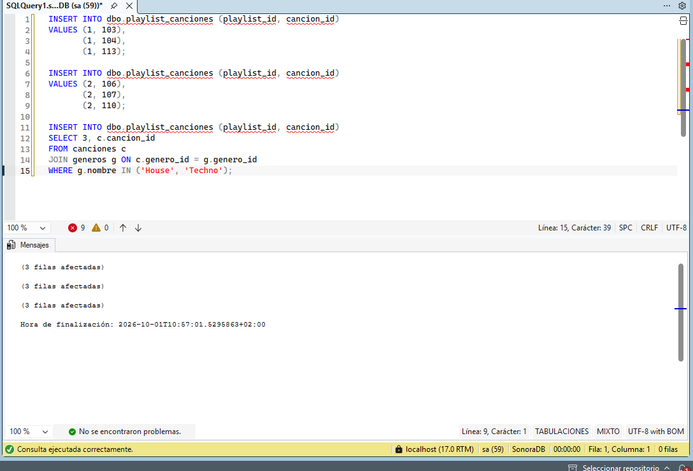

---

### Ejercicio 34

Comprueba que las restricciones protegen los datos. Ejecuta cada intento por separado, anota el número de error y qué restricción lo provoca:

1. Añadir otra vez la canción 103 a la playlist 1.
2. Añadir la canción 999 a la playlist 1.
3. Crear una playlist para alexbeats llamada `AB`.
4. Crear otra playlist para alexbeats llamada `Perreo Mañanero`.

**Respuesta teórica:**

Las restricciones actúan de la siguiente manera:

1. La segunda inserción de la canción 103 en la playlist 1 viola la clave primaria compuesta de `playlist_canciones`, porque la pareja `(playlist_id, cancion_id)` ya existe. SQL Server devuelve `Msg 2627`.

2. La canción 999 no existe en `canciones`, por lo que se viola la clave foránea `playlist_canciones.cancion_id → canciones.cancion_id`. SQL Server devuelve `Msg 547`.

3. El nombre `AB` tiene menos de 3 caracteres y viola la restricción `CHECK` creada sobre `playlists.nombre`. SQL Server devuelve `Msg 547`.

4. La playlist `Perreo Mañanero` ya existe para el usuario 1 y se viola la restricción `UNIQUE` sobre `(usuario_id, nombre)`. SQL Server devuelve `Msg 2627`.

Los intentos fallidos que afectan a una columna `IDENTITY` pueden consumir valores de identidad. Por ello, que aparezcan saltos en los identificadores es un comportamiento normal y `IDENTITY` no garantiza una numeración consecutiva.

**Evidencia — captura del resultado en SSMS:**

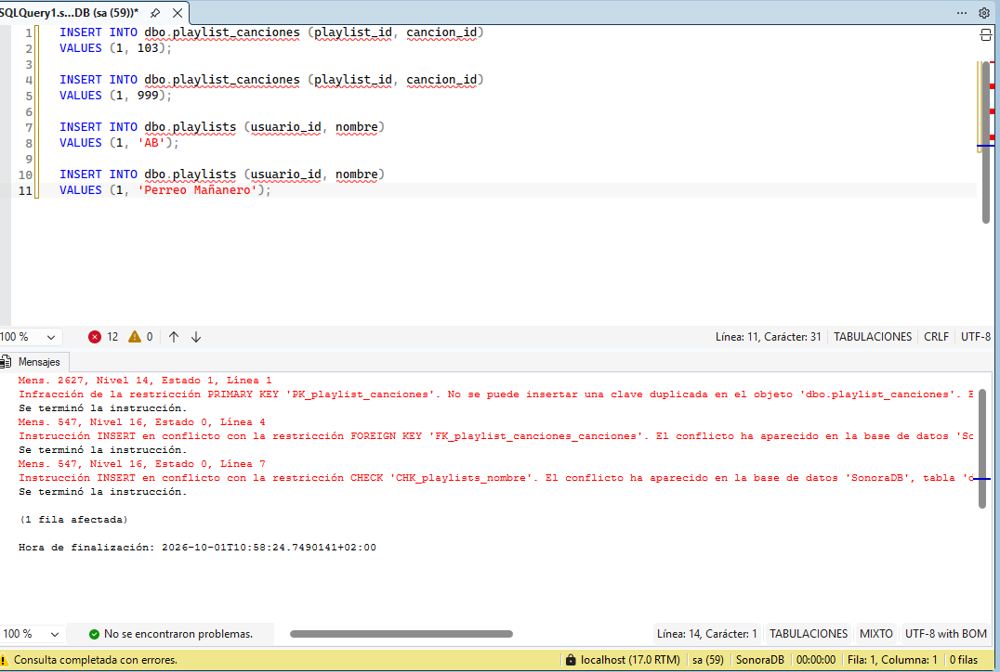

---

### Ejercicio 35

Aplica dos actualizaciones:

- Añade a la playlist 2 la descripción `Guitarras para la oficina`.
- Con un `UPDATE` que haga JOIN con `usuarios`, haz públicas todas las playlists cuyo dueño tenga plan `Premium`.

**Evidencia — captura del resultado en SSMS:**

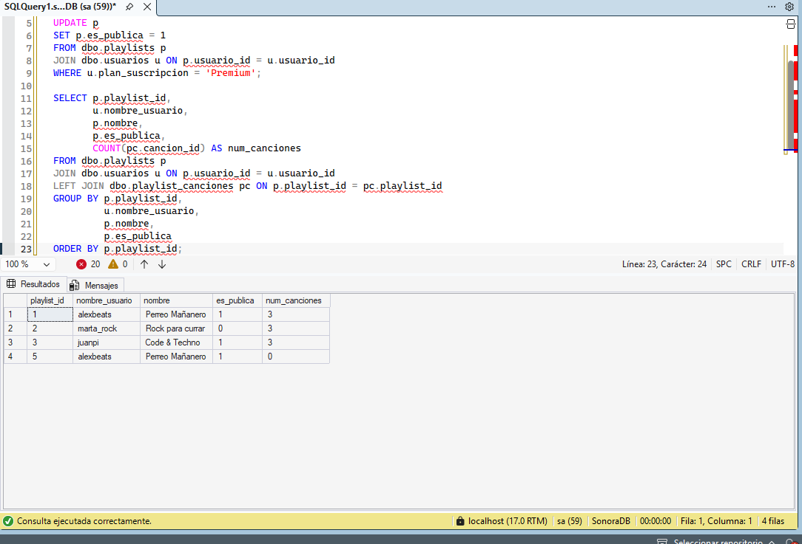

---

### Ejercicio 36

Obtén un resumen de las playlists: id, dueño, nombre, si es pública y número de canciones. Ordena por id.

**Evidencia — captura del resultado en SSMS:**

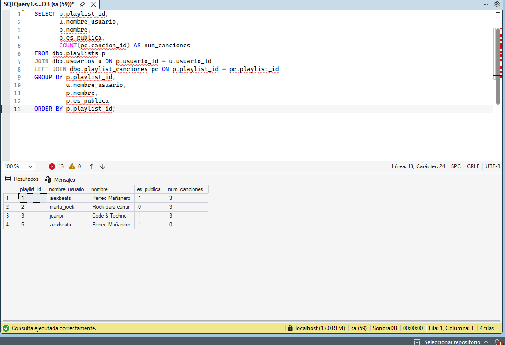

---

### Ejercicio 37

Aplica estos borrados:

1. Quita la canción `Forja` (110) de la playlist 2.
2. Intenta borrar la playlist 3 directamente. Anota el error.
3. Borra la playlist 3 correctamente, en el orden necesario.

**Evidencia — captura del resultado en SSMS:**

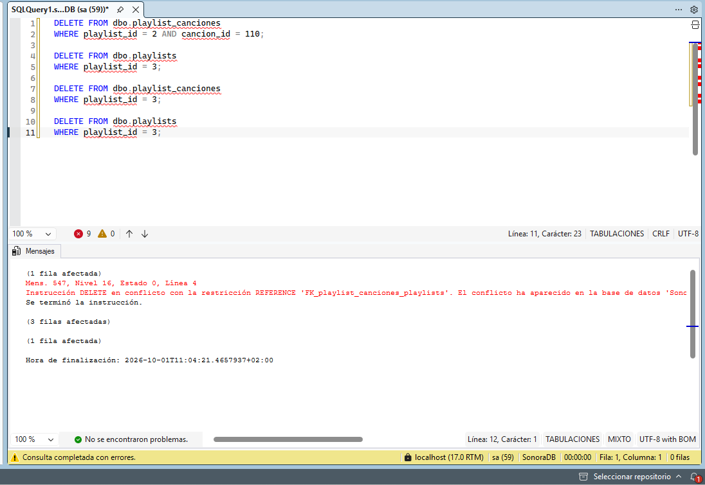

---

### Ejercicio 38

Soporte quiere probar qué pasaría si marta_rock (usuario 2) pasara a Premium, sin que el cambio quede guardado. Dentro de una transacción explícita, actualiza su plan, consulta el valor, deshaz el cambio y vuelve a consultarlo.

**Evidencia — captura del resultado en SSMS:**

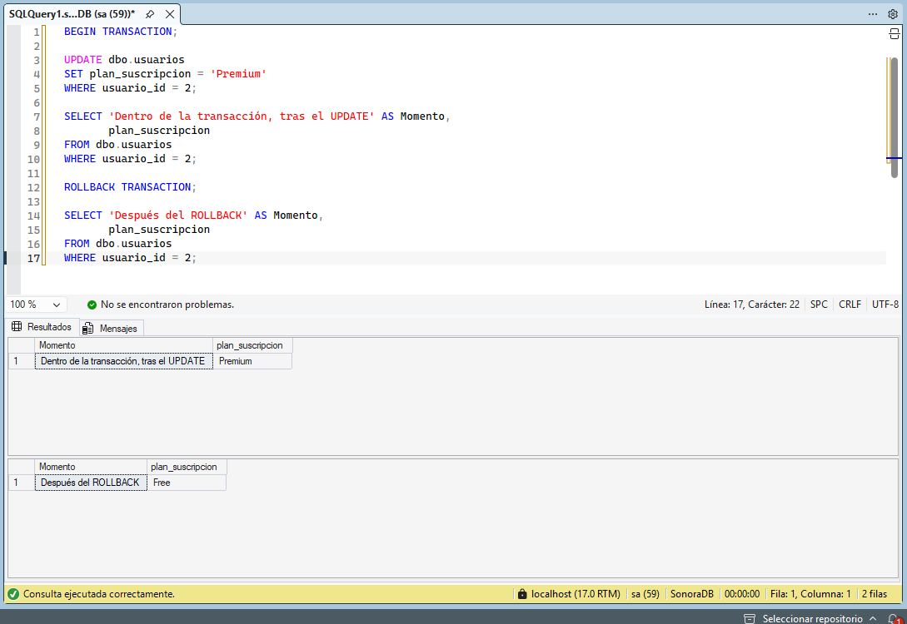

---

### Ejercicio 39

Deja `SonoraDB` como estaba: elimina las tablas `playlist_canciones` y `playlists` en el orden correcto y de forma que el script no falle si ya no existen. Comprueba con `sys.tables` que vuelven a quedar las 8 tablas del Ejercicio 2.

---

**Evidencia — captura del resultado en SSMS:**

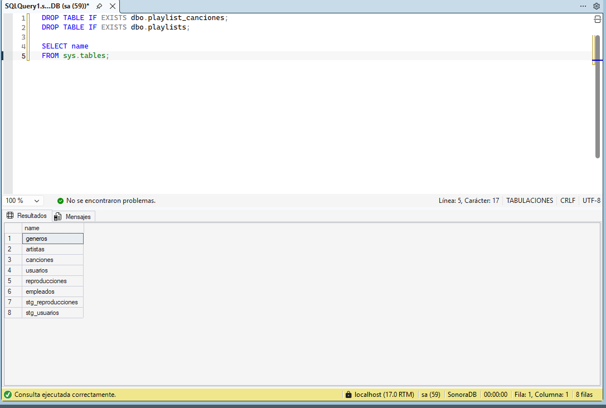

---

## Checklist final

- [ ] He ejecutado todas las consultas/scripts en `SonoraDB`.
- [ ] He pegado una captura en cada apartado que requiere evidencia.
- [ ] Las capturas muestran la consulta o el resultado de forma legible.
- [ ] He comprobado especialmente los ejercicios con errores esperados (6, 8, 23, 25, 28 y 34).
